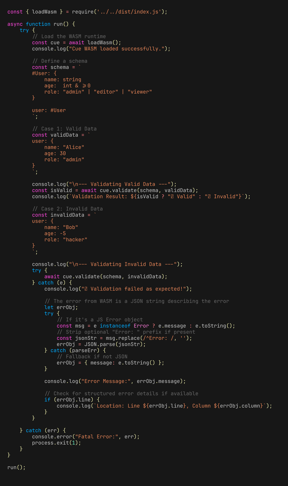

# cue-wasm

A lightweight, secure WebAssembly (WASM) runtime for [Cuelang](https://cuelang.org/), enabling you to run CUE validation, unification, and export directly in the browser or Node.js environments without a backend.


## Features

- **Unify**: Merge multiple CUE files/strings and apply tags.
- **Validate**: Verify data against a CUE schema with structured error reporting.
- **Export**: Convert CUE to JSON, YAML, or CUE formats.
- **Secure**: Runs in a sandboxed WASM environment with no file system access.
- **Portable**: Works in Node.js (>=18) and modern browsers.

## Performance & Bundle Size

The compiled WebAssembly binary is approximately **30MB** raw. However, in production:

1.  **Compression**: Served via Gzip/Brotli, the transfer size drops to **~6.6MB** (Gzip) or less.
2.  **Lazy Loading**: The WASM binary is loaded asynchronously. Your application's initial bundle size remains small; the 6MB hit only occurs when the CUE runtime is actually requested.
3.  **Caching**: If using the default CDN loader, the binary is cached aggressively by the browser (immutable versioned URL).

**Optimization Tip:** If you have `binaryen` installed, the build script will automatically run `wasm-opt` to shrink the binary further.

## Installation

```bash
npm install @GeoffMillerAZ/cue-wasm
```

### CDN (No Bundler)

The WASM binary is available via free CDNs. The library automatically fetches from jsDelivr by default if no local path is provided.

- **jsDelivr:** `https://cdn.jsdelivr.net/npm/@GeoffMillerAZ/cue-wasm/bin/cue.wasm`
- **UNPKG:** `https://unpkg.com/@GeoffMillerAZ/cue-wasm/bin/cue.wasm`

## Usage



Check out the [examples/](examples/) directory for runnable code samples:
- [Node.js Examples](examples/README.md#nodejs-examples)
- [Browser Playground](examples/README.md#browser-example)

### Node.js

```javascript
const { loadWasm } = require('@GeoffMillerAZ/cue-wasm');

async function main() {
    const cue = await loadWasm();

    // 1. Unify
    const result = await cue.unify({
        'schema.cue': 'val: string',
        'data.cue': 'val: "hello"'
    });
    console.log(result); // {"val": "hello"}

    // 2. Validate
    try {
        await cue.validate('val: int', 'val: "string"');
    } catch (e) {
        console.error(e.message); // conflicting values...
    }
}

main();
```

## Development

### Prerequisites

- Go 1.24+
- Node.js 18+

### Build

To compile the Go source into WASM:

```bash
./build.sh
```

### Test

Run the integration and security test suites:

```bash
npm test          # Integration tests
npm run test:security  # Security regression tests
```

## Contributing

Please read [CONTRIBUTING.md](CONTRIBUTING.md) for details on our code of conduct, and the process for submitting pull requests to us.

## Security

See [SECURITY.md](SECURITY.md) for our security policy and reporting guidelines.

## License

This project is licensed under the MIT License - see the [LICENSE](LICENSE) file for details.
