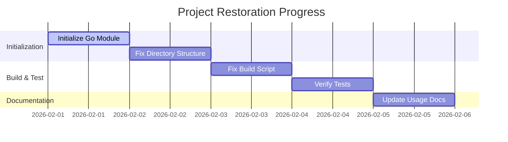

# Maintainer Progress Tracker

## Status Visualization

## Task Checklist

- [x] **Initialization**
    - [x] Initialize Go module (`go mod init pac/pkg/cue-wasm`)
    - [x] Tidy dependencies (`go mod tidy`)
- [x] **Code Structure Fixes**
    - [x] Fix `main.go` imports to match module name
    - [x] Ensure `internal/core` is accessible
- [x] **Build System**
    - [x] Update `build.sh` paths to match root structure
    - [x] Ensure output directories exist (`pkg/cue-wasm/bin` or adapted to `dist/`)
- [x] **Verification**
    - [x] Run `build.sh` successfully
    - [x] Run integration tests (`npm test` / `node test/integration/test.js`)
- [x] **Environment Setup**
    - [x] Create `workspace/` directory for local artifacts
    - [x] Add `.gitignore` to protect sensitive local data
- [x] **Dependency Hardening**
    - [x] Pin Go version (`1.24.4`) and dependencies (`go.sum`)
    - [x] Add `engines` to `package.json` (`node >= 18.0.0`)
- [x] **Security Audit**
    - [x] Create `SECURITY.md` policy
    - [x] Verify no npm vulnerabilities (`npm audit`)
    - [x] Verify File System Isolation (LFI Test) (`npm run test:security`)
- [x] **Community & CI**
    - [x] Create `README.md`, `LICENSE`, `CONTRIBUTING.md`, `CODE_OF_CONDUCT.md`
    - [x] Create GitHub Issue & PR Templates
    - [x] Setup GitHub Actions (`test.yml`, `release.yml`)
- [x] **Examples Inventory**
    - [x] Node.js: Validation, Unification, Tags, Export
    - [x] Browser: Interactive Playground (`index.html`)
    - [x] Documentation: `examples/README.md` linked to root
    - [x] Docker: Unified multi-stage build for all demos (`examples/Dockerfile`)
- [x] **Testing Suite (Gold Standard)**
    - [x] Integration Tests (`test:integration`)
    - [x] Security Regression Tests (`test:security`)
    - [x] Edge Cases & Concurrency (`test:edge`)
    - [x] Examples Verification (`test:examples`)
    - [x] Docker Verification (`test:docker` - CI enabled)
    - [x] Unified Test Runner (`npm test`)
- [x] **Documentation Polish (Charm Bracelet)**
    - [x] `freeze`: Generated code snippets (`docs/assets/example_code.png`)
    - [x] `slides`: Terminal presentation (`docs/slides.md`)
    - [ ] `vhs`: GIF Demo (Requires `ffmpeg` in env)
    - [x] `GEMINI.md`: Context file for AI Agents
