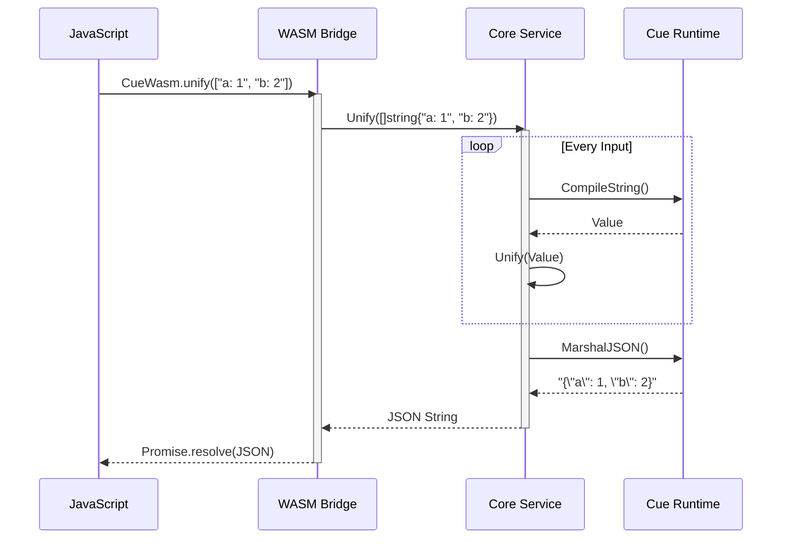

# Specification: API Surface

**Target:** `v1.0.0`
**Status:** DRAFT

## 1. Core Interface (Go)
The Core Service must expose these high-level operations:

```go
type CueService interface {
    // Unify takes a list of Cue strings and returns the unified result as JSON.
    Unify(inputs []string) (string, error)

    // Validate checks if 'concrete' satisfies 'schema'.
    Validate(schema string, concrete string) error

    // Export converts a Cue string to a specific format (JSON, YAML).
    Export(input string, format string) (string, error)
}
```

## 2. JavaScript Bridge (WASM)
The Adapter will expose a global object `CueWasm` with the following methods:

### `CueWasm.unify(inputs: string[]) : Promise<string>`
*   **Input:** Array of Cuelang source strings.
*   **Output:** JSON string of the unified result.
*   **Errors:** Rejects promise with Cue error message.

### `CueWasm.validate(schema: string, data: string) : Promise<boolean>`
*   **Input:** Schema string, Data string (JSON or Cue).
*   **Output:** `true` (valid) or throws Error (invalid).

## 2.3. Sequence Logic



## 3. Test Scenarios
1.  **Basic Unify:** `["a: 1", "b: 2"]` -> `{"a": 1, "b": 2}`.
2.  **Conflict:** `["a: 1", "a: 2"]` -> Error "conflicting values".
3.  **Validation:** Schema `a: int`, Data `a: "string"` -> Error "mismatched types".
