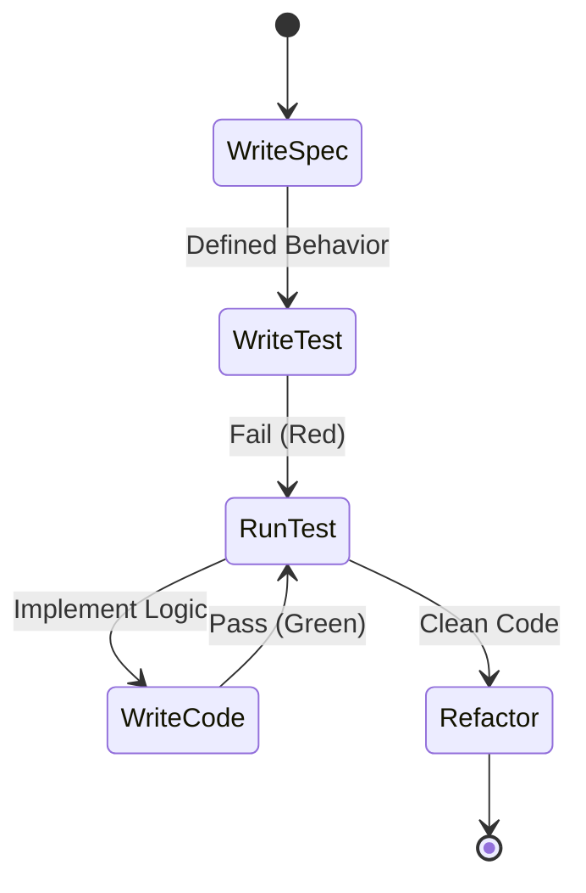
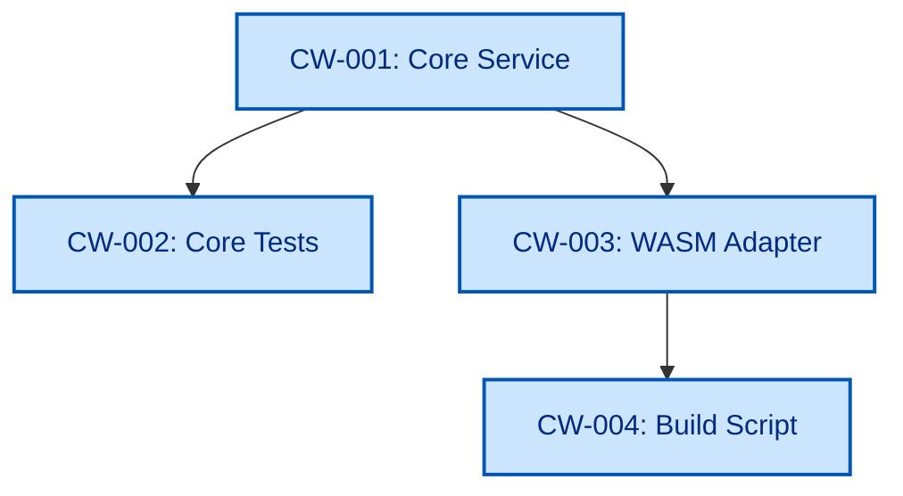

# Implementation Tracker: Cue-WASM

**Design:** [System Overview](../design/system_overview.md)
**Status Legend:** ⚪ Todo | 🔵 Drafted | 🟠 Implemented | ✅ Verified

## TDD Workflow

## Task Dependency Graph

## Task List

| ID | Task | Spec Ref | Test Ref | Status |
| :--- | :--- | :--- | :--- | :--- |
| **CW-001** | Implement Core Cue Logic (Unify/Export) | `specs/001-api-surface.md` | `internal/core/service_test.go` | ✅ Verified |
| **CW-002** | Gold Standard Core Tests (Table Driven) | `specs/001-api-surface.md` | `internal/core/service_test.go` | ✅ Verified |
| **CW-003** | Implement WASM Bridge (`syscall/js`) | `specs/001-api-surface.md` | `pkg/cue-wasm/test/integration/test.js` | ✅ Verified |
| **CW-004** | Create Build Script (`build_wasm.sh`) | N/A | N/A | ✅ Verified |
