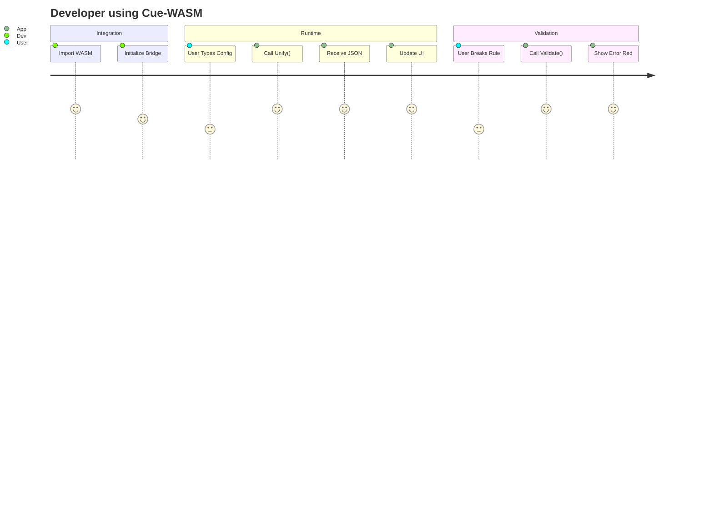

# User Stories: Cue-WASM

**Tracker:** [Implementation Tracker](../tracking/implementation_tracker.md)

## Core Capabilities

### US-CW-001: Client-Side Configuration
*   **As a** frontend developer,
*   **I want** to validate user input against a Cuelang schema in the browser,
*   **So that** I can provide instant feedback without a server roundtrip.

### US-CW-002: Dynamic Unification
*   **As a** platform engineer,
*   **I want** to merge multiple partial configuration snippets into a single JSON object,
*   **So that** I can build a "drag-and-drop" configuration builder.

### US-CW-003: Format Conversion
*   **As a** user,
*   **I want** to see the JSON equivalent of my Cuelang code,
*   **So that** I can debug the output of my logic.

## User Journey

