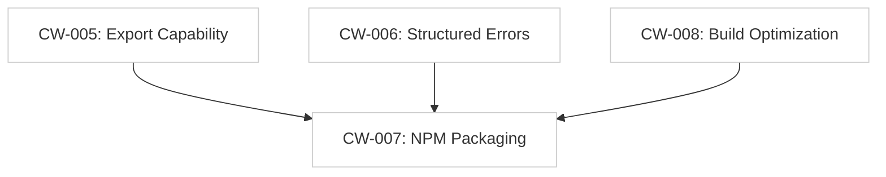

# Cue-WASM v1.0 Polish Tracker

**Goal:** Create a production-grade, community-ready NPM package for Cuelang in the browser.
**Parent Tracker:** [Implementation Tracker](./implementation_tracker.md)

## Gap Analysis (Community Needs)
To be a "Standard Library" for the community, we need more than just my use case.
*   **Format Support:** Users need YAML, JSON, and Cuelang (formatted).
*   **Developer Experience:** TypeScript types are non-negotiable.
*   **Error Reporting:** "Invalid config" isn't enough. We need "Invalid config at line 10:4".
*   **Size:** WASM is heavy. We must measure and document the size.

## Task Dependency Graph

## Task List

| ID | Task | Description | Status |
| :--- | :--- | :--- | :--- |
| **CW-005** | Implement `CueWasm.export(code, format)` | Support `json`, `yaml`, `cue` (fmt). | ✅ Verified |
| **CW-006** | Implement Structured Errors | Return `{ msg: string, line: int, col: int }`. | ✅ Verified |
| **CW-007** | Create `package.json` & `index.d.ts` | Define API for TypeScript users. | ✅ Verified |
| **CW-008** | Optimize Binary Size | Use ldflags `-s -w` and measure gzip size. | ✅ Verified (6.3MB gzip) |
| **CW-009** | Tags Support in Unify | Allow passing key=value tags for unification. | ✅ Verified |
| **CW-010** | Multi-file Overlay Support | Allow passing a map of filename to content. | ✅ Verified |
| **CW-011** | Version Reporting | Add `CueWasm.version()` to report Cue SDK version. | ✅ Verified |
